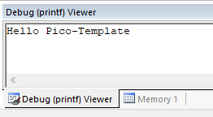
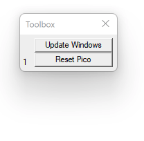
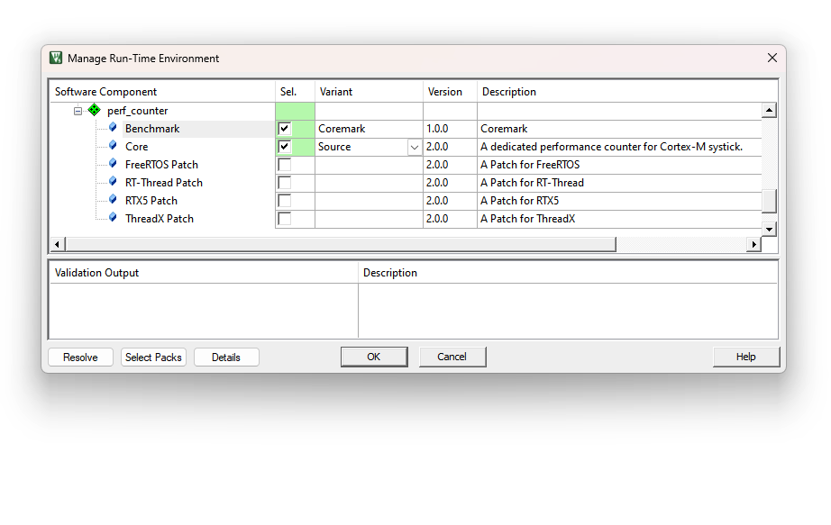
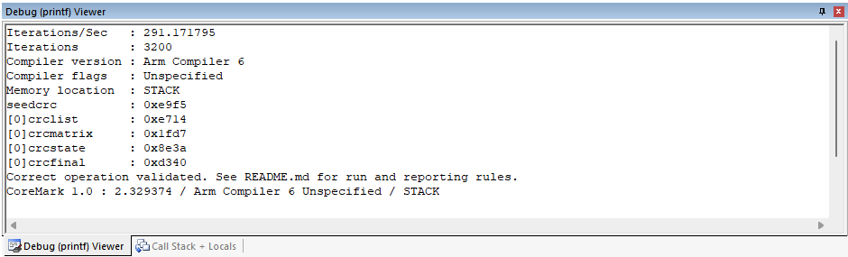
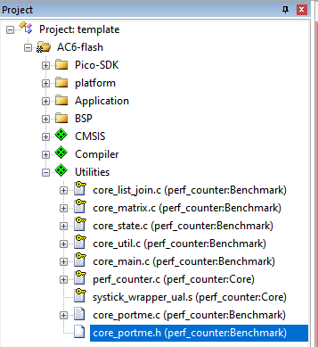

# Pico_Template (v2.3.2)
适用于 RP2040 的 MDK 模板

- 使用树莓派官方 [RP2xxxx_DFP](https://www.keil.arm.com/packs/rp2xxx_dfp-raspberrypi/boards/)
- 添加 Flash 编程算法。

  - 特别感谢 [Aladdin-Wang](https://github.com/Aladdin-Wang)。[他出色的工作](https://github.com/Aladdin-Wang/RP2040_Flash_Algorithm)让使用过程轻松许多！
  - 特别感谢 [fang316](https://github.com/fang316)，他的建议改进了 Flash 编程算法的部署方式。
- 编译器：Arm Compiler 6.15 及以上版本（使用非侵入式封装层，以支持使用 GCC 编写的 pico-sdk）
- 改进的 BSP 支持

- **已可运行 [Arm-2D](https://github.com/ARM-software/Arm-2D) 基准测试**
- **已支持 CoreMark**
- **支持在 MDK 中调试**

  - [使用 CMSIS-DAP](https://github.com/majbthrd/pico-debug)（已在 MDK 中验证，**强烈推荐**）
  - **支持下载到 Flash**
- 为以下配置添加专用工程设置：
  - [**AC6-flash**] 在 Flash 中运行代码（XIP）

  - [**AC6-DebugInSRAM**] 原始 pico-sdk 中的 "no_flash" 模式。


# 1 使用方法

MDK 工程位于路径 "ROOT\project\mdk"。这里假定您已了解如何使用 MDK 进行常规编译。

### 1.1 如何设置栈和堆大小

通常需要调整栈和堆的大小，而在此模板中操作非常简单。请在相同的 MDK 工程目录中找到文件 "RP2040.sct"。其中的宏 ***STACK_0_SIZE*** 用于栈，***HEAP_0_SIZE*** 用于堆。


```
#define STACK_0_SIZE        (1024*4)
#define STACK_1_SIZE        (1024*1)

#define HEAP_0_SIZE         (1024*32)
#define HEAP_1_SIZE         (1024*1)
```

***注意***：

1. 请**不要**在这些常量值后添加 "**u**"。
2. `STACK_1_SIZE` 和 `HEAP_1_SIZE` 未被使用。如需减少 RAM 占用，可将其设置为合理的较小值。


### 1.2 如何重定向 stdout/stdin

为了利用 pico-sdk，此模板通过桥接函数将 stdout/stdin 的底层函数重定向到 pico-sdk 内部 `stdio.c` 实现的 `_read` 和 `_write`。

```
/*----------------------------------------------------------------------------*
 * bridge the Arm Compiler's stdio and the pico-sdk's stdio                   *
 *----------------------------------------------------------------------------*/
__attribute__((weak))
int stdin_getchar(void)
{
    /*! \note If you don't want to use pico-sdk stdio, then you can implement
     *!       function by yourself in other c source code. Your scanf will work
     *!       directly.
    *!       by default, we use this function to bridge the _read implemented
     *!       in stdio.c of pico-sdk
     */

    int byte;
    _read(0, (char *)&byte, 1);
    return byte;
}

__attribute__((weak))
int stdout_putchar(int ch)
{
    /*! \note If you don't want to use pico-sdk stdio, then you can implement
     *!       function by yourself in other c source code. Your printf will work
     *!       directly.
    *!       by default, we use this function to bridge the _write implemented
     *!       in stdio.c of pico-sdk
     */

    return _write(1, (char *)&ch, 1);
}

```

这些桥接函数使用了 "weak" 属性。因此，如果您希望将 ***printf/scanf*** 直接重定向到可直接查看和/或完全控制的位置，请在任一 C 源文件中实现这些桥接函数（无需删除弱定义版本），例如将字符发送到 USART，或直接保存到内存块。

**注意**：此模板旨在让您能够自由选择，而不需要深入研究脚本才能获得这种自由。


使用配置 **AC6-DebugInSRAM-printf** 时，借助 EventRecorder，所有 ***printf*** 输出都会重定向到 MDK 内的 '**Debug (printf) Viewer**'（如下图所示）。




### 1.3 如何使用 pico-debug（CMSIS-DAP）进行调试

[Pico-debug](https://github.com/majbthrd/pico-debug) 是一个开源项目，可将 RP2040 中的一个 Cortex-M0+ 核心变为 CMSIS-DAP 适配器。这意味着无需额外硬件，只使用一根 USB 线即可在 MDK 中调试 Pico。为此，请先[下载最新版 uf2 文件](https://github.com/majbthrd/pico-debug/releases)。


Pico-Template 提供专门的工程配置，用于在 SRAM 中下载和调试代码。这是三种配置中最方便的一种，能够提供最佳开发体验。请按以下步骤操作：

1. 按住 **BOOTSEL** 按钮启动 Pico。
2. 将 **pico-debug-gimmecache.uf2** 拖放到文件浏览器中的 RPI-RP2 大容量存储设备。它会立即重启为 **CMSIS-DAP 适配器**。Pico-debug 以仅 RAM 的 `.uf2` 镜像加载，因此不会写入 Flash，也不会替换现有用户代码。
3. 编译并调试
5. 开始使用……

**注意：**

**1. 在此模式下，"RESET" 并不会如预期那样工作。如需复位，请单击下图所示的 "Reset Pico" 按钮：**



**2. 若找不到此工具箱，请启动调试会话并依次进入菜单 "View"->"Toolbox Window"。**


### 1.4 如何运行 CoreMark

借助 `perf_counter v2.0.0`，现在可以如下图所示，仅通过 RTE 中的一次点击在 Pico-Template 上运行 **[CoreMark](https://github.com/eembc/coremark)**：



随后，`main()` 中的一段代码将运行 CoreMark：

```c
int main(void)
{
    system_init();

    printf("Hello Pico-Template\r\n");

    ...

#if defined( __PERF_COUNTER_COREMARK__ ) && __PERF_COUNTER_COREMARK__
    printf("\r\nRun Coremark 1.0...\r\n");
    coremark_main();
#endif
    ...

    while (true) {
        ...
    }
}
```

默认情况下，可在如下图所示的 **Debug (printf) View** 中查看测试结果：




**注意**：
- **CoreMark 必须至少运行 10 秒才能生成有效结果**。若运行时间不足，可将 `core_portme.h` 中定义的宏 `ITERATIONS` 改为更大的值，然后重试。

- 调试与下载接口的线序为CLK DIO VCC/3V3 GND，从上到下。

