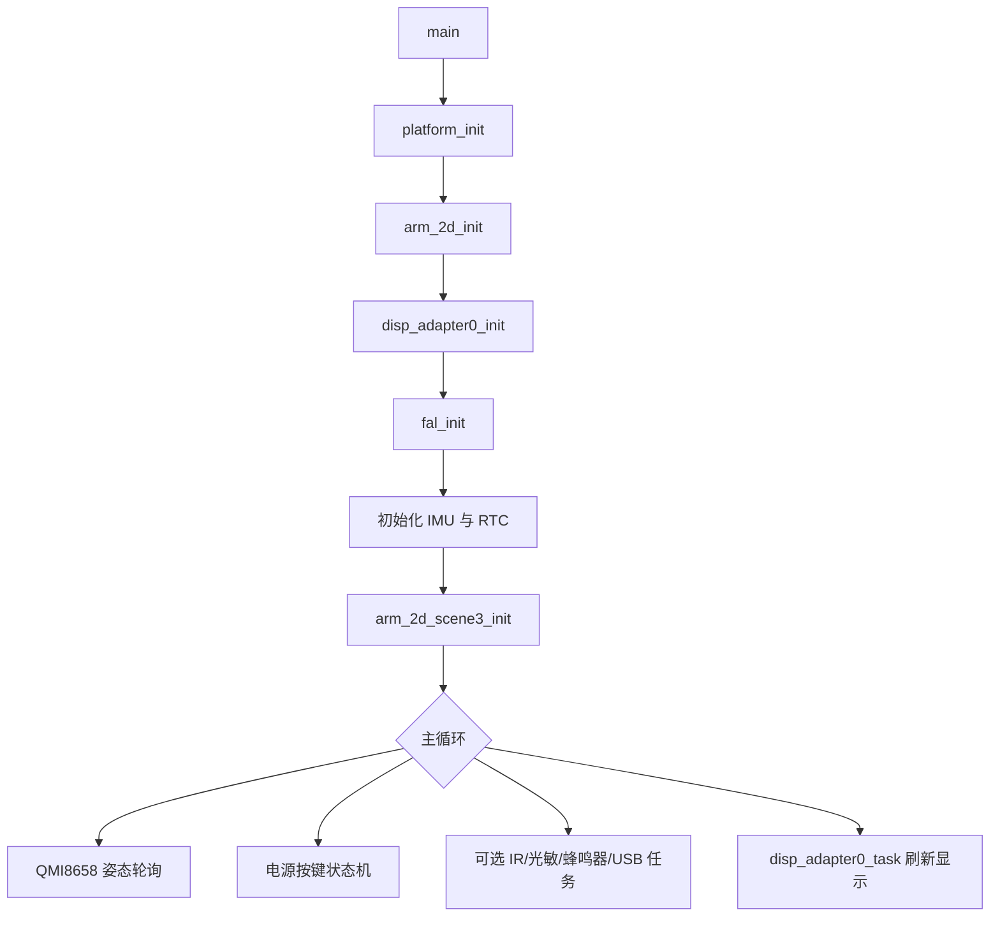

# RP2040 Arm-2D Flip 工程结构说明

## 1. 工程概览

本目录是一个面向 RP2040 的 Keil MDK 工程，使用 Arm Compiler 6、Raspberry Pi RP2xxx Device Family Pack（DFP）和 Arm-2D 图形库。工程输出运行于 Flash 的 UF2 固件，主要集成：

- ST7789 显示屏与 Arm-2D 场景渲染；
- QMI8658 六轴 IMU、BM8563 RTC、红外、光敏、蜂鸣器等板级外设；
- TinyUSB HID 鼠标及可选 USB MSC-SD 功能；
- SDIO/SPI SD 卡、FatFs 文件系统及 FAL Flash 抽象层；
- 3D、火焰翻页和无限走廊等 Arm-2D 资源加载与渲染示例。

Keil 工程文件为 [project/mdk/template.uvprojx](project/mdk/template.uvprojx)，当前目标为 `AC6-flash`：面向 Cortex-M0+，使用 Arm Compiler 6，在 Flash 中执行（XIP）。构建前会调用 DFP 提供的 `pio_all.bat` 生成 PIO 头文件；构建后通过 `elf2uf2.exe` 生成 `template.uf2`。

## 2. 启动与运行流程

入口文件为 [main.c](main.c)。主要流程如下：



`main.c` 中的编译期宏决定部分功能是否启用：

| 宏 | 默认值 | 作用 |
| --- | ---: | --- |
| `RP2040_SDCARD_RUN_PERF_TEST` | `0` | 运行 SD 卡/FatFs 性能测试 |
| `RP2040_IR_TASK_ENABLE` | `0` | 启用红外收发自测任务 |
| `RP2040_LIGHT_TASK_ENABLE` | `0` | 启用光敏传感器任务 |
| `RP2040_IMU_SAMPLE_ENABLE` | `1` | 启用 QMI8658 姿态采样 |
| `RP2040_BUZZER_TASK_ENABLE` | `0` | 启用蜂鸣器播放任务 |
| `RP2040_USB_MSC_SD_ENABLE` | `0` | 启用 USB MSC-SD 桥接 |

电源保持逻辑也位于 `main.c`：GPIO2 用于保持供电，GPIO9 用于检测按键；上电后检测按键松开，运行中长按约 1 秒关闭保持电源。

## 3. 顶层文件与目录

```text
01_RP2040_Keil-arm2d_flip/
├── main.c                 # 程序入口、初始化与主循环
├── README.md              # 原始 Pico_Template 使用说明
├── PROJECT_STRUCTURE_CN.md # 本文档
├── AGENTS.md              # 代码风格与本地构建约定
├── 3d/                    # 3D 模型数据、加载器和模型转换工具
├── application/           # 应用层任务、USB、SD 卡与资源加载适配层
├── corridor/              # 无限走廊场景的资源加载器
├── deivers/               # 芯片级外设驱动（目录名沿用现有拼写）
├── documents/Pictures/    # README 和文档使用的图片资源
├── fire/                  # 火焰模拟、翻页效果与相关资源加载器
├── lib/                   # 第三方源码与补丁：TinyUSB、pico_fix
├── middleware/            # FatFs-SD 与 FAL 中间件
├── move/                  # 运动相关场景与姿态处理实验代码
├── pic/                   # 供显示场景使用的图像资源 C 数组
├── platform/              # 板级初始化、LCD 和 RP2040 PIO 资源
└── project/mdk/           # Keil 工程、RTE 配置、构建输出
```

## 4. 模块说明

### 4.1 `platform/`：板级支持与显示输出

| 文件 | 职责 |
| --- | --- |
| [app_platform.c](platform/app_platform.c) | 实现 `platform_init()`；配置系统时钟、电压、周期计数器、标准 I/O 和显示屏。文件名采用 `app_platform.c`，避免与 RP2040 DFP 中的 `platform.c` 产生对象文件名冲突。 |
| [platform.h](platform/platform.h) | 平台初始化及显示接口声明。 |
| [st7789_simple.c](platform/st7789_simple.c) | ST7789 显示驱动与同步/异步位图输出。 |
| `st77xx_parallel_stream.pio`、`st77xx_parallel_byte.pio` | PIO 程序源码；构建前由 `pioasm` 转换为同名 `.pio.h`。 |

Arm-2D 经由 `Disp0_DrawBitmap()` 与 `disp_adapter0_task()` 将帧缓冲输出到 ST7789。

### 4.2 `application/`：应用层任务和适配器

该目录将底层驱动封装为可被 `main.c` 或 Arm-2D 场景调用的任务与服务。

| 模块 | 职责 |
| --- | --- |
| `qmi8658c_task.*`、`qmi8658_motion.*` | 初始化 QMI8658，读取六轴数据并处理姿态/运动信息。 |
| `bm8563_task.*` | 为 BM8563 RTC 提供板级 I2C 适配和时间读取服务。 |
| `ir_task.*` | 红外收发环回自测任务，默认发射 GPIO28、接收 GPIO22。 |
| `light_task.*` | GL5528 光敏传感器应用任务，使用 GPIO26/ADC0。 |
| `buzzer_task.*`、`keil_fc14_pcm.inc` | DET402 无源蜂鸣器的 PCM 播放任务与音频样本。 |
| `usb_descriptors.c`、`usb_mouse.*` | TinyUSB HID 鼠标描述符与行为逻辑。 |
| `usb_msc_sd.*` | 将 SD 卡作为 USB 大容量存储设备导出。 |
| `rp2040_sdcard.*` | FatFs 挂载、读写与性能测试的辅助层。 |
| `arm_loader_io_fatfs.*` | Arm-2D QOI/LMSK 文件加载器的 FatFs I/O 适配器。 |
| `arm_2d_scene_sd_qoi.*`、`arm_2d_scene_sd_lmsk.*` | 从 SD 卡资源加载 QOI/LMSK 的场景实现。 |
| `bsp_cfg.h`、`fal_cfg.h`、`rp2040_flash_layout.h` | 板级、FAL 和 Flash 布局配置。 |

### 4.3 `deivers/`：底层设备驱动

`deivers` 是项目既有目录名称，Keil 工程路径已依赖此拼写，不应随意重命名。

| 驱动 | 功能 |
| --- | --- |
| `drv_QMI8658.*` | QMI8658 六轴 IMU 的 I2C 寄存器访问、原始数据和单位换算。 |
| `bm8563.*` | 与硬件无关的 BM8563 RTC 驱动，通过读写回调访问总线。 |
| `drv_paj7620.*` | PAJ7620 手势传感器的分组寄存器访问。 |
| `drv_ir.*` | 红外收发，使用 Pico alarm 回调实现非阻塞时序。 |
| `drv_light.*` | GL5528 ADC 采样、阻值与照度估算。 |
| `drv_buzzer.*` | PWM 音调、音符表及 PCM 播放。 |

### 4.4 `middleware/`：存储与 Flash 抽象

| 目录 | 内容 |
| --- | --- |
| `fatfs_sd/` | FatFs R0.15、SD 卡通用层、DMA、中断、SDIO 和 SPI 两种传输后端，以及 RP2040 硬件配置。 |
| `fal/` | Flash Abstraction Layer；`fal_flash_rp2040.c` 实现 RP2040 Flash 分区访问。 |

当前 `AC6-flash` 目标将 FatFs、SDIO/SPI 驱动和 FAL 源文件加入编译。功能开关决定其运行时是否被调用。

### 4.5 `lib/`：第三方源码与兼容补丁

| 目录 | 内容 |
| --- | --- |
| `tinyusb/` | TinyUSB 源码。当前工程编译设备栈、HID、MSC 与 RP2040 Device Controller Driver。 |
| `pico_fix/` | RP2040 USB 枚举兼容修复，工程引用 `rp2040_usb_device_enumeration.c`。 |

### 4.6 图形、场景与资源

| 目录 | 内容 |
| --- | --- |
| `project/mdk/RTE/Acceleration/` | Arm-2D Pack 生成或纳入工程的场景源码、显示适配器和配置。`main.c` 调用其中的 `arm_2d_scene3_init()`。 |
| `3d/` | 三维模型顶点/面/法线 C 数组，以及 3D 和圆弧通用资源加载器。`tools/` 提供 STL/OBJ 到 C 数组的 Python/GUI 转换工具。 |
| `fire/` | 火焰模拟、翻页渲染、Q16 计算和火焰/翻页资源加载器。 |
| `corridor/` | 无限走廊场景所需的资源加载器。 |
| `move/` | 运动场景和姿态处理相关代码，适合作为实验或扩展示例。 |
| `pic/` | 背景等静态图像资源的 C 数组。 |

工程树中存在的文件不一定都加入当前 `AC6-flash` 目标；应以 `template.uvprojx` 中的 `<FilePath>` 条目为准。场景相关文件还可能由 RTE 组件选择状态控制。

## 5. `project/mdk/`：Keil 工程与运行时环境

| 路径 | 职责 |
| --- | --- |
| `template.uvprojx` | 工程、目标、编译器、链接器、源文件分组和 RTE 组件配置。 |
| `RTE/` | Keil Run-Time Environment 生成或管理的组件配置，包括 `Acceleration`、`CMSIS-View`、`Compiler`、`Device`、`Utilities` 和 `_AC6-flash`。 |
| `RTE/Device/RP2040_Core0/` | RP2040 启动、散装加载文件、boot2 配置与链接脚本。 |
| `Objects/` | 编译中间文件、AXF 和 Keil 构建日志；属于构建产物。 |
| `Listings/` | 汇编/链接列表文件；属于构建产物。 |
| `template.uf2` | 构建完成后生成的 RP2040 下载镜像。 |
| `app_cfg.h` | 工程级应用配置，并通过 C/C++ 的 `-include` 参数强制包含。 |

## 6. 构建依赖与配置要点

- 目标芯片：`RP2040:Core0`。
- 目标配置：`AC6-flash`。
- 编译器：Arm Compiler 6；工程当前选择 ArmClang 6.24。
- DFP：`RaspberryPi.RP2xxx_DFP.0.9.5`。
- 链接脚本：`project/mdk/RTE/Device/RP2040_Core0/rp2040.sct`。
- 输出目录：`project/mdk/Objects/`。
- PIO：构建前在 `project/mdk/` 运行 DFP 的 `pio_all.bat`，因此 `.pio` 与生成的 `.pio.h` 应保持匹配。
- 输出格式：构建后的 AXF 由 `elf2uf2.exe` 转换为 UF2。

工程在 C/C++ 和汇编器的附加参数中均配置了：

```text
-Wno-unused-command-line-argument
```

该选项用于忽略 ArmClang 对 DFP 注入的 `boot2_config.h` 强制包含参数给出的无用参数告警，不应删除 `-include` 配置本身。

## 7. 常见修改入口

| 需求 | 建议修改位置 |
| --- | --- |
| 调整启动、循环任务或功能开关 | `main.c` |
| 调整显示时钟、背光/屏幕初始化或刷屏方式 | `platform/app_platform.c`、`platform/st7789_simple.c` |
| 添加一个板级外设任务 | `application/`；底层寄存器逻辑放入 `deivers/` |
| 增加 Arm-2D 场景 | `project/mdk/RTE/Acceleration/`，并遵循 `AGENTS.md` 中的场景命名和 OOC 风格 |
| 添加 SD 卡资源加载 | `application/arm_loader_io_fatfs.*` 与对应 SD 场景 |
| 修改 Flash 分区 | `application/rp2040_flash_layout.h`、`application/fal_cfg.h` |
| 增加 USB 类或端点 | `application/usb_descriptors.c`、`application/usb_mouse.*`、`application/usb_msc_sd.*` 与 TinyUSB 配置 |
| 导入 3D 模型 | 使用 `3d/tools/mesh_to_c_gui.py` 或 `mesh_to_c.py` 生成 C 数组，再接入 `3d/` 加载器 |

## 8. 修改注意事项

- 不要直接编辑 `Objects/`、`Listings/`、`template.uf2` 等构建产物。
- RTE 中的文件可能由 Keil Pack 管理；修改前应判断该文件是项目副本还是 Pack 文件。
- 新增场景应遵循工程约定：文件名为 `arm_2d_scene_<name>.c/.h`，并沿用 `user_scene_<name>_t`、`__arm_2d_scene_<name>_*` 等 Arm-2D 场景模式。
- `lib/tinyusb/` 是随工程提交的第三方源码副本；其内部列出的上游可选子模块不等同于本工程的已锁定构建依赖。
- 修改 Keil 工程配置后，若 uVision 已打开工程，需重新加载工程再编译，以确保 `template.uvprojx` 的新设置生效。